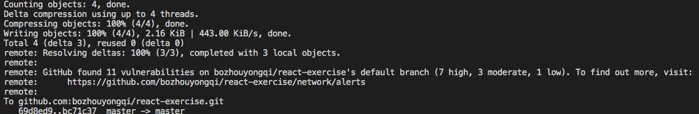

最近在github中提交代码时，总是会有vulnerabilitied alerts的警告。其原因是github中检测出项目依赖的包易
受到攻击，安全性脆弱。因此需要解决该问题。



遇到这种问题一般将依赖包升级一下就行。需要看下当前依赖包的源安装包，可以在package.lock或者yarn.lock中溯源看到源安装包。

若是没有问题，可以直接将安装包更新到最新版本
```
yarn upgrade xxx@latest
```

如果最新版本有较大的兼容问题，则在github中查看security tab页，查看当前警告的包最低可以升级到哪个版本，然后可以使用yarn info xxx,查看安装包的具体版本信息。